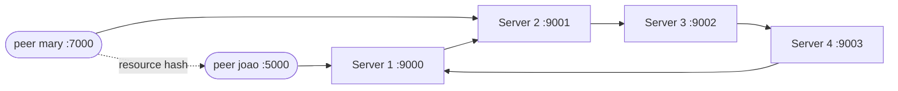

<a id="top"></a>
<h1 align="center">java-p2p</h1>

<p align="center">A UDP peer-to-peer network where a ring of super-nodes splits the MD5 key space — a college assignment on distributed hash tables, written in plain Java.</p>

<p align="center">
  
  
  
</p>

<p align="center"><b>🇺🇸 English</b> · <a href="README.pt-BR.md">🇧🇷 Português</a></p>

---

## Contents

- [Overview](#overview)
- [Architecture](#architecture)
- [How it works](#how-it-works)
- [Protocol](#protocol)
- [Project structure](#project-structure)
- [Running](#running)
- [Known issues](#known-issues)
- [Academic context](#academic-context)

<a id="overview"></a>
## Overview

This project is a peer-to-peer network over UDP. Super-nodes (servers) are arranged in a ring, and each one owns a slice of the MD5 key space, which makes the ring a simple distributed hash table (DHT).

A peer:

1. joins a super-node with a nickname (`create <nickname>`);
2. keeps itself alive by sending a heartbeat every 5 seconds;
3. shares one piece of content, identified by its MD5 hash, and can register that hash in the ring;
4. can list every resource registered in the ring;
5. can ask another peer directly whether it holds the content for a given hash.

When a super-node receives a hash outside its slice, it forwards the request to the next super-node in the ring.

This version is kept as an archive of the code delivered for the course.

[↑ back to top](#top)

<a id="architecture"></a>
## Architecture



- **Server** (`app/server/Server.java`): one node of the ring. It keeps the list of connected peers, their heartbeat counters and the resources whose hash falls in its slice.
- **Peer** (`app/peer/Peer.java`): starts three threads:
  - `PeerThread` receives packets and answers `resource` requests;
  - `PeerClient` reads commands from the keyboard;
  - `PeerHeartbeat` sends `heartbeat` to the server every 5 seconds.

[↑ back to top](#top)

<a id="how-it-works"></a>
## How it works

### Key space

Each resource is identified by the MD5 hash of its content (32 hex characters, a number between 0 and 2^128 − 1). With a ring of `N` servers, the server at position `p` (1-based) owns:

```
MIN = (2^128 / N) * (p - 1)
MAX = (2^128 / N) * p - 1
```

This is computed with `BigInteger` in `app/bucket/DHTHashMd5.java`. `DHTBucket` stores a resource only when its hash is inside `[MIN, MAX]`.

### Peers and heartbeats

- On `create <nickname>`, the server stores the peer (`HostData`: address, nickname, port) and sets its counter to 15.
- Every `heartbeat <nickname>` resets the counter to 15.
- The server receives with a 500 ms timeout. Every time a receive ends in an exception (including the timeout), the `DecreaseHeartBeat` command decreases all counters by one. A peer whose counter reaches 0 is removed and logged as `INACTIVE`.

### Registering a resource

1. The peer sends `register <hash>` to a server.
2. If the hash is in that server's slice, it is stored together with the peer's port (`DATA STORED.`).
3. Otherwise the server sends `register_ring <hash> <peer_port> <server_port>` to the next server, which stores it or forwards it again.

### Listing resources

1. The peer sends `list user` to a server.
2. The server starts a `list_ring <entries> <peer_port> <server_port>` message with its own resources (`hash-port;hash-port;…`).
3. Each server in the ring appends its resources and passes the message on.
4. When the message returns to the server that started it, that server sends the peer the header `CONTENT_HASH-PEER_PORT` followed by one packet per entry, or `NO RESOURCE FOUND`.

### Asking a peer for content

The peer sends `resource <hash>` to another peer. The other peer answers `I HAVE THIS CONTENT!` followed by the content, or `I DO NOT HAVE THIS CONTENT...`.

The content each peer shares is generated at startup as `<first argument>_<random UUID>`.

[↑ back to top](#top)

<a id="protocol"></a>
## Protocol

Text messages, one per UDP datagram.

| Message | From → to | Answer |
| --- | --- | --- |
| `create <nickname>` | peer → server | `OK` / `NOT OK` (nickname already in use) |
| `heartbeat <nickname>` | peer → server, every 5 s | — |
| `register <hash>` | peer → server | stored locally or forwarded as `register_ring` |
| `register_ring <hash> <peer_port> <server_port>` | server → next server | stored or forwarded again |
| `list user` | peer → server | starts a `list_ring` |
| `list_ring <entries> <peer_port> <server_port>` | server → next server | on return: `CONTENT_HASH-PEER_PORT` + entries, or `NO RESOURCE FOUND` |
| `resource <hash>` | peer → peer | `I HAVE THIS CONTENT!` + content / `I DO NOT HAVE THIS CONTENT...` |

[↑ back to top](#top)

<a id="project-structure"></a>
## Project structure

```
app/
  server/            Server (main loop), HostData (connected peer)
  peer/              Peer (main), PeerThread (receiver), PeerClient (console), PeerHeartbeat
  command/           ICommand + one class per operation:
                     CreateCommand, HeartBeatCommand, DecreaseHeartBeat,
                     RegisterCommand, ListCommand, ListResourseCommand
  bucket/            IDHTBucket/DHTBucket (resource storage),
                     IDHTHash/DHTHashMd5 (key-space slice), BucketResource (hash + port)
  resource_manager/  ResourceManager (shared content) + hash/Md5HashOperator
  socket/            Socket (DatagramSocket wrapper) + SocketPayload
Makefile             compiles the classes with javac
setup.sh             builds and opens one terminal per server and per peer
server_config.json   ring of 4 servers (ports 9000–9003)
peer_config.json     3 peers (joao, mary, leo)
```

The server uses a small Command pattern: every operation is an `ICommand<T>` with a `run()` method.

[↑ back to top](#top)

<a id="running"></a>
## Running

**Requirements:** a JDK, `make`, and — for the automatic setup — Linux with `gnome-terminal` and `jq`.

**Automatic setup** (compiles, opens a terminal for each server in `server_config.json` and each peer in `peer_config.json`):

```bash
./setup.sh
```

**Manual setup**, from the repository root:

```bash
make

# server: <port> <next_server_port> <ring_position> <ring_size>
java app/server/Server 9000 9001 1 2
java app/server/Server 9001 9000 2 2

# peer: <server_host> "create <nickname>" <peer_port> <server_port>
java app/peer/Peer localhost "create joao" 5000 9000
java app/peer/Peer localhost "create mary" 7000 9001
```

**Peer console commands:**

| Command | Effect |
| --- | --- |
| `register <server_ip> <server_port>` | registers this peer's content hash in the ring |
| `list user <server_ip> <server_port>` | lists every resource in the ring |
| `resource <hash> <peer_ip> <peer_port>` | asks another peer for the content with that hash |

The last two words of every command must be an IP and a port.

[↑ back to top](#top)

<a id="known-issues"></a>
## Known issues

A later code review found the following problems in this version:

| # | Where | Issue |
| --- | --- | --- |
| 1 | `Server.java` | The nickname (`vars[1]`) is read before the argument count is checked, so any one-word packet throws an exception. |
| 2 | `Server.java` | Heartbeat counters are decreased inside `catch (Exception)`. They go down on every receive timeout **and** on every malformed packet: under constant traffic peers never expire, and invalid packets make them expire faster. |
| 3 | `DecreaseHeartBeat.java` | `timeout.get()` can return `null` (NPE), and a counter that skips 0 and goes negative is never removed. |
| 4 | `DHTHashMd5.java` | The last server's `MAX` is `(2^128 / N) * N − 1`. When `N` does not divide 2^128 (e.g. 3 servers), the highest hashes belong to no server. |
| 5 | `Server.java` (`register_ring`) | A forwarded registration never checks whether it came back to its origin. A hash that no server owns (item 4, or a non-MD5 value) loops around the ring forever. |
| 6 | `Server.java` | The next server is always `localhost`. `list` is forwarded to the *peer's* address on the next server's port, and the final answer goes to the previous server's address instead of the peer. The ring only works on a single machine. |
| 7 | `BucketResource.java` | Only the peer's port is stored, not its address, so the list cannot tell other machines where a resource is. |
| 8 | `Socket.java` | Packets are built with `content.length()` instead of the byte length, using the platform charset: non-ASCII text is truncated. The 1024-byte buffer silently truncates long `list_ring` messages. |
| 9 | `Socket.java` | A bind failure (port in use) is only printed; the socket stays `null` and fails later with an NPE. `receivePacket` returns `null` on timeout, and callers do not check it. |
| 10 | `PeerClient.java` | Only `IOException` is caught. An empty line, a missing argument or a non-numeric port (`ArrayIndexOutOfBoundsException`, `NumberFormatException`), or end of input (`null`), stops the console thread. The help text lists a `peer` command that is not implemented. |
| 11 | `PeerHeartbeat.java` | It prints `peer_port + 100` as its port but binds `peer_port + 200`. On a send error it closes the socket and keeps looping on the closed socket. |
| 12 | `HeartBeatCommand.java` | Heartbeats are matched by nickname only, so any host can keep any nickname alive. A peer that expired is ignored by later heartbeats and never registered again. The peer ignores a `NOT OK` answer to `create`. |
| 13 | `Peer.java` | The shared content is built from `args[0]` (the server host, usually `localhost`) instead of the nickname. |
| 14 | `Md5HashOperator.java`, `DHTBucket.java` | `HASH IS …` is printed on every hash computation; `DHTBucket.get()` prints the value instead of returning it. |
| 15 | Build | The `Makefile` does not list every class and `make clean` does not remove `app/**/*.class`. Compiled `.class` files are committed. `setup.sh` depends on `gnome-terminal` and `jq`, so it only runs on Linux. |

[↑ back to top](#top)

<a id="academic-context"></a>
## Academic context

College assignment from 2022. This snapshot is the code exactly as delivered; only this documentation was added afterwards.

[↑ back to top](#top)
