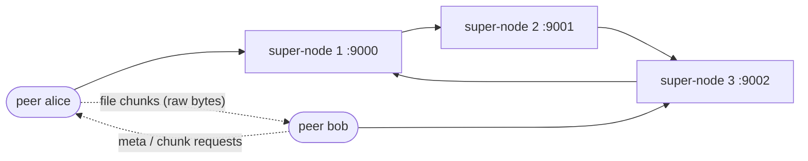

<a id="top"></a>
<h1 align="center">java-p2p</h1>

<p align="center">A UDP peer-to-peer file-sharing network where a ring of super-nodes partitions the MD5 key space — a small DHT written from scratch in Java 21, with zero runtime dependencies.</p>

<p align="center">
  <a href="https://github.com/joaolaureano/java-p2p/actions/workflows/ci.yml"></a>
  
  
  
  
</p>

<p align="center"><b>🇺🇸 English</b> · <a href="README.pt-BR.md">🇧🇷 Português</a></p>

---

## Contents

- [Overview](#en-overview)
- [Architecture](#en-architecture)
- [How the DHT works](#en-dht)
- [Protocol](#en-protocol)
- [File transfer](#en-transfer)
- [Project structure](#en-structure)
- [Getting started](#en-getting-started)
- [Tests](#en-tests)
- [What changed since v1](#en-changes)
- [Known limitations](#en-limitations)
- [Academic context](#en-academic)
- [License](#en-license)

<a id="en-overview"></a>
## Overview

java-p2p is a peer-to-peer file-sharing network built on UDP. A ring of super-nodes splits the MD5 key space (2^128) into equal slices — a simple distributed hash table — and indexes which peer holds which file. The files themselves travel directly between peers, as raw bytes.

Each peer:

1. joins a super-node with a nickname (`create <nickname>`) and stays alive with heartbeats every 5 s (it expires after 15 s of silence);
2. shares every file in its `shared/` folder, plus any file added with `share <path>` — any type: PDFs, images, archives, text;
3. registers each file in the ring under the MD5 of its content, with its name and size;
4. can list every file registered in the ring (`list`);
5. downloads a file from its owner with `get <hash>`: the file is pulled chunk by chunk over UDP, lost packets are retried, and the result is checked against the MD5 before it lands in `downloads/`.

Requests that the current super-node does not own travel around the ring (`register_ring`, `list_ring`) carrying their origin, and stop when they get back to it.

[↑ back to top](#top)

<a id="en-architecture"></a>
## Architecture



Three super-nodes form the ring. Each one owns a slice of the hash space, and each peer attaches to a single super-node for `create`, `heartbeat`, `register` and `list`. The ring only stores *who has what*; file content never goes through it — the downloader talks to the owner directly.

[↑ back to top](#top)

<a id="en-dht"></a>
## How the DHT works

Every resource is identified by the MD5 hash of its content. The ring divides the 2^128 key space into `N` equal slices:

```
slice = 2^128 / N
node i owns [slice * (i - 1), slice * i - 1]
the last node owns up to 2^128 - 1
```

Giving the remainder to the last node means no hash is ever left without an owner, even when `N` does not divide 2^128 exactly.

For a ring of 3 nodes:

| Node | Port | Hash range |
| --- | --- | --- |
| super-node 1 | 9000 | `0000…0` – `5555…4` |
| super-node 2 | 9001 | `5555…5` – `aaaa…9` |
| super-node 3 | 9002 | `aaaa…a` – `ffff…f` |

Each super-node logs the range it owns when it starts:

```
[node 9000] Owns HashRange[00000000000000000000000000000000 .. 55555555555555555555555555555554]
```

[↑ back to top](#top)

<a id="en-protocol"></a>
## Protocol

Every datagram is a UTF-8 header line, optionally followed by a newline and a raw binary body (like a tiny HTTP). Control messages are plain text; file data is never converted to text. Datagrams are at most 9 KiB.

| Message | Sender → receiver | Reply |
| --- | --- | --- |
| `create <nickname>` | peer → super-node | `OK` / `ERROR name already taken: <nickname>` |
| `heartbeat <nickname>` | peer → super-node (every 5 s) | none (an unknown peer is registered again) |
| `register <hash> <size> <name>` | peer → super-node | `REGISTERED <hash> at node <host:port>` / `ERROR …` |
| `register_ring <hash> <size> <name> <peer_host> <peer_port> <origin_host> <origin_port>` | super-node → next | the owner replies to the peer |
| `list` | peer → super-node | `RESOURCES <n>` + one packet per `<hash>,<size>,<host>,<port>,<name>`, or `NO RESOURCE FOUND` |
| `list_ring <peer_host> <peer_port> <origin_host> <origin_port> [entries…]` | super-node → next | the origin replies to the peer |
| `meta <hash>` | peer → peer | `meta_ok <hash> <size> <chunks> <name>` / `meta_missing <hash>` |
| `chunk <hash> <index>` | peer → peer | `chunk_data <hash> <index>` + newline + up to 8 KiB of raw bytes |

File names are URL-encoded on the wire, so spaces, commas and accents are safe.

[↑ back to top](#top)

<a id="en-transfer"></a>
## File transfer

Downloads are **pull-based and stop-and-wait**, which keeps UDP reliable without any extra library:

1. `meta <hash>` → the owner answers with size, number of 8 KiB chunks and file name.
2. For each chunk, `chunk <hash> <i>` → `chunk_data` with the bytes. If no answer arrives in 500 ms the request is sent again, up to 5 times.
3. Chunks are written to `downloads/<name>.part`; at the end the size and the MD5 are verified and the file is renamed (`name (1).ext` if it already exists). On any failure the partial file is deleted.

Only files the peer chose to share can be served — a request carries a hash, never a path.

[↑ back to top](#top)

<a id="en-structure"></a>
## Project structure

```
src/main/java/p2p/
  network/  UdpEndpoint, Packet, Message, MessageType          UDP transport; text header + binary body framing
  dht/      HashRange, ResourceTable, ResourceEntry, Md5        key-space partition and storage
  server/   SuperNode, SuperNodeConfig, PeerRegistry, PeerInfo  ring node and peer liveness
  peer/     PeerNode, PeerConsole, ConsoleCommand, PeerListener,
            SharedFiles, SharedFile, FileDownloader,
            HeartbeatSender, PeerConfig, DownloadException      peer process, file sharing and console
src/test/java/p2p/                                              unit tests + in-process ring and transfer tests
scripts/    start-ring.sh, stop-ring.sh, start-peer.sh          local demo helpers
```

[↑ back to top](#top)

<a id="en-getting-started"></a>
## Getting started

**Prerequisites:** JDK 21+ and Maven. At runtime only the JDK is used (`DatagramSocket`, `FileChannel`, `MessageDigest`, `BigInteger`).

**Build and test**

```bash
mvn verify
```

**Start a ring of 3 super-nodes** on ports 9000–9002 (logs go to `logs/`)

```bash
scripts/start-ring.sh 3
```

**Start two peers**, each in its own terminal. Each peer gets `peers/<nickname>/shared` and `peers/<nickname>/downloads`; drop any files into `shared` before starting, or use `share <path>` later.

```bash
scripts/start-peer.sh alice 5000 9000
scripts/start-peer.sh bob   5001 9002
```

**Stop the ring**

```bash
scripts/stop-ring.sh
```

Without the scripts:

```bash
java -cp target/classes p2p.server.SuperNode <port> <next_port> <ring_position> <ring_size> [next_host] [host]
java -cp target/classes p2p.peer.PeerNode <server_host> <server_port> <nickname> <peer_port> [shared_dir] [downloads_dir]
```

**Peer console commands**

| Command | Effect |
| --- | --- |
| `share <path>` | share any file and register it in the ring |
| `files` | list the files this peer shares |
| `register [host port]` | announce all shared files again |
| `list [host port]` | list every file in the ring |
| `get <hash> [peer_host peer_port]` | download a file (owner taken from the last `list` when omitted) |
| `info`, `help`, `quit` | peer details, help, leave |

**Sample session** — bob's terminal; lines starting with `>` are what was typed:

```
Nickname:  bob
Port:      5001
Shared:    peers/bob/shared
Downloads: peers/bob/downloads
Files:     0
<- 127.0.0.1:9002: OK
> list
-> 127.0.0.1:9002: list
<- 127.0.0.1:9002: RESOURCES 3
<- 127.0.0.1:9002: c2cb79d26cb5ebe485b33382c371bbf0  1429  notes.txt  @127.0.0.1:5000
<- 127.0.0.1:9002: d41d8cd98f00b204e9800998ecf8427e  0  empty.dat  @127.0.0.1:5000
<- 127.0.0.1:9002: 2d26ce93b2b1fa902f35bddda5a7ba95  3000000  photo archive.bin  @127.0.0.1:5000
> get 2d26ce93b2b1fa902f35bddda5a7ba95
Downloading 2d26ce93b2b1fa902f35bddda5a7ba95 from 127.0.0.1:5000...
Saved peers/bob/downloads/photo archive.bin (3000000 bytes, md5 ok)
```

[↑ back to top](#top)

<a id="en-tests"></a>
## Tests

```bash
mvn verify
```

66 JUnit 5 tests. Besides the unit tests (key-space partition, binary framing with bytes like `0x00`/`0x0A`/invalid UTF-8, file-name encoding, peer registry with a controllable clock, console parsing), two suites run over **real UDP inside the test process**:

- a 3-node ring: routing, `list`, malformed packets, duplicate nicknames and the loop guard;
- file transfer: a random 100 KiB file, an empty file, an exact multiple of the chunk size, an unknown hash, a name collision, and an **uploader that drops every third request** — the download must still finish byte-identical.

GitHub Actions runs the same command on every push.

[↑ back to top](#top)

<a id="en-changes"></a>
## What changed since v1

The version delivered for the course is frozen as the tag [`v1.0.0-original`](https://github.com/joaolaureano/java-p2p/tree/v1.0.0-original). v2.0.0 keeps the same design; it fixes every bug found in a review of v1, reorganizes the code and adds tests. v2.1.0 then replaces the placeholder shared string with real file sharing (any file type, chunked UDP transfer, MD5-verified).

| # | Bug in v1 | Fix in v2 |
| --- | --- | --- |
| 1 | The server read the nickname argument before checking the packet length, so any one-word packet threw. | Every packet is parsed and validated by `Message.parse`; malformed ones are logged and ignored. |
| 2 | Heartbeat expiry ran inside `catch (Exception)`, triggered by receive timeouts *and* malformed packets: under traffic peers never expired, junk packets expired them faster. | Expiry is time-based and runs on its own scheduled thread, once per second. |
| 3 | The heartbeat counter could throw `NullPointerException` and never removed values that went below zero. | Counters were replaced by last-seen timestamps in `PeerRegistry`. |
| 4 | The partition left the tail of the MD5 space without an owner when `N` does not divide 2^128 (e.g. 3 nodes). | The last node owns everything up to 2^128 − 1 (`HashRange.forNode`). |
| 5 | `register_ring` never noticed it had come back to its origin: infinite loop for hashes nobody owns. | Ring messages carry their origin; the origin stops them and answers `ERROR no node owns <hash>`. |
| 6 | The next super-node was hard-coded as `localhost`, `list` was forwarded to the peer's address, and the final answer went to the previous hop instead of the peer: it only worked on one machine. | The next node's host is configurable, and ring answers are sent to the requesting peer. |
| 7 | Resource entries stored only the peer's port, not its host. | `ResourceEntry` stores hash, host and port. |
| 8 | Packet length used `String.length()` instead of the byte length (plus the platform charset), truncating non-ASCII text; the 1024-byte buffer truncated long lists. | UTF-8 everywhere, byte-accurate lengths, 8 KB datagrams with a size check. |
| 9 | Socket bind failures were swallowed (null socket, NPE later) and `receive` returned `null` on timeout. | `UdpEndpoint` fails fast with a clear message; `receive` returns `Optional.empty()` on timeout. |
| 10 | The peer console only caught `IOException`: empty or invalid input, or EOF, killed it. Help advertised a `peer` command that did not exist. | `ConsoleCommand` validates every line; errors are printed and the console keeps running. Help lists only real commands. |
| 11 | The heartbeat opened a third socket on a different port than the one it printed, and on error closed it and kept looping. | `HeartbeatSender` uses the peer's own socket and never closes it. |
| 12 | Heartbeats trusted the nickname only (anyone could keep someone else alive), expired peers were never registered again, and a rejected nickname was ignored by the peer. | Heartbeats are accepted only from the address:port that owns the nickname; unknown peers are registered again; a rejected nickname stops the peer. |
| 13 | The shared content was built from the server's host name instead of the nickname. | Peers share real files; the name and content come from the files themselves. |
| 14 | A debug line was printed on every hash, and the bucket's `get()` printed instead of returning. | No debug output; `ResourceTable.get` returns an `Optional`. |
| 15 | Incomplete Makefile, committed `.class` files, and launch scripts that required `gnome-terminal` + `jq` (Linux only). | Maven build, `.gitignore`, portable bash scripts, CI. |

How the v1 code maps to v2:

| v1 | v2 |
| --- | --- |
| `app/socket/Socket` | `network/UdpEndpoint`, `network/Packet` |
| `app/bucket/*` | `dht/HashRange`, `dht/ResourceTable`, `dht/ResourceEntry` |
| `app/command/*` | handler methods in `server/SuperNode` + `server/PeerRegistry` |
| `app/server/HostData` | `server/PeerInfo` |
| `app/peer/PeerClient`, `PeerThread`, `PeerHeartbeat` | `peer/PeerConsole`, `PeerListener` + `FileDownloader`, `HeartbeatSender` |
| `app/resource_manager/*` | `peer/SharedFiles`, `dht/Md5` |

[↑ back to top](#top)

<a id="en-limitations"></a>
## Known limitations

These are deliberate scope limits, not bugs:

- Stop-and-wait transfer: one chunk in flight at a time, so throughput is bound by latency (fine on a LAN, slow over long distances). No resume of interrupted downloads.
- Ring membership is static (configured at start); there is no join/leave protocol.
- A `list` answer must fit in one datagram.
- No authentication or encryption.
- Files of expired peers stay listed in the ring.

[↑ back to top](#top)

<a id="en-academic"></a>
## Academic context

This started as a college assignment in 2022. The delivered version is kept unchanged under the tag `v1.0.0-original`, so the two versions can be compared side by side.

[↑ back to top](#top)

<a id="en-license"></a>
## License

[MIT](LICENSE) © João Pedro Laureano

[↑ back to top](#top)
