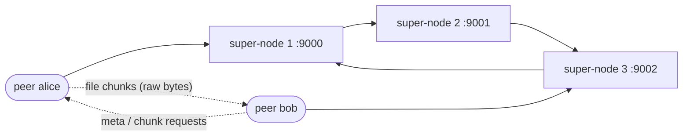

<a id="top"></a>
<h1 align="center">java-p2p</h1>

<p align="center">Uma rede peer-to-peer de compartilhamento de arquivos sobre UDP em que um anel de super-nodes particiona o espaço de chaves MD5 — uma pequena DHT escrita do zero em Java 21, sem nenhuma dependência em tempo de execução.</p>

<p align="center">
  <a href="https://github.com/joaolaureano/java-p2p/actions/workflows/ci.yml"></a>
  
  
  
  
</p>

<p align="center"><a href="README.md">🇺🇸 English</a> · <b>🇧🇷 Português</b></p>

---

## Sumário

- [Visão geral](#pt-visao-geral)
- [Arquitetura](#pt-arquitetura)
- [Como a DHT funciona](#pt-dht)
- [Protocolo](#pt-protocolo)
- [Transferência de arquivos](#pt-transferencia)
- [Estrutura do projeto](#pt-estrutura)
- [Como rodar](#pt-como-rodar)
- [Testes](#pt-testes)
- [O que mudou desde a v1](#pt-mudancas)
- [Limitações conhecidas](#pt-limitacoes)
- [Contexto acadêmico](#pt-contexto)
- [Licença](#pt-licenca)

<a id="pt-visao-geral"></a>
## Visão geral

java-p2p é uma rede peer-to-peer de compartilhamento de arquivos sobre UDP. Um anel de super-nodes divide o espaço de chaves MD5 (2^128) em fatias iguais — uma tabela hash distribuída (DHT) simples — e indexa qual peer tem qual arquivo. Os arquivos em si trafegam diretamente entre os peers, como bytes crus.

Cada peer:

1. entra em um super-node com um nickname (`create <nickname>`) e se mantém vivo com heartbeats a cada 5 s (expira após 15 s de silêncio);
2. compartilha todos os arquivos da sua pasta `shared/`, além de qualquer arquivo adicionado com `share <caminho>` — de qualquer tipo: PDFs, imagens, compactados, texto;
3. registra cada arquivo no anel pelo MD5 do conteúdo, com nome e tamanho;
4. pode listar todos os arquivos registrados no anel (`list`);
5. baixa um arquivo do dono com `get <hash>`: o arquivo é puxado pedaço por pedaço via UDP, pacotes perdidos são pedidos de novo e o resultado é conferido pelo MD5 antes de ir para `downloads/`.

Requisições que o super-node atual não possui percorrem o anel (`register_ring`, `list_ring`) levando a origem, e param quando voltam a ela.

[↑ voltar ao topo](#top)

<a id="pt-arquitetura"></a>
## Arquitetura



Três super-nodes formam o anel. Cada um é dono de uma fatia do espaço de hashes, e cada peer se conecta a um único super-node para `create`, `heartbeat`, `register` e `list`. O anel guarda só *quem tem o quê*; o conteúdo nunca passa por ele — quem baixa fala direto com o dono.

[↑ voltar ao topo](#top)

<a id="pt-dht"></a>
## Como a DHT funciona

Cada recurso é identificado pelo hash MD5 do seu conteúdo. O anel divide o espaço de 2^128 chaves em `N` fatias iguais:

```
slice = 2^128 / N
node i owns [slice * (i - 1), slice * i - 1]
the last node owns up to 2^128 - 1
```

Como o último node fica com o resto, nenhum hash fica sem dono, mesmo quando `N` não divide 2^128 exatamente.

Para um anel de 3 nodes:

| Node | Porta | Faixa de hashes |
| --- | --- | --- |
| super-node 1 | 9000 | `0000…0` – `5555…4` |
| super-node 2 | 9001 | `5555…5` – `aaaa…9` |
| super-node 3 | 9002 | `aaaa…a` – `ffff…f` |

Cada super-node registra no log a faixa que possui ao iniciar:

```
[node 9000] Owns HashRange[00000000000000000000000000000000 .. 55555555555555555555555555555554]
```

[↑ voltar ao topo](#top)

<a id="pt-protocolo"></a>
## Protocolo

Todo datagrama é uma linha de cabeçalho UTF-8, opcionalmente seguida de uma quebra de linha e de um corpo binário cru (como um HTTP em miniatura). Mensagens de controle são texto; os dados dos arquivos nunca viram texto. Datagramas têm no máximo 9 KiB.

| Mensagem | Origem → destino | Resposta |
| --- | --- | --- |
| `create <nickname>` | peer → super-node | `OK` / `ERROR name already taken: <nickname>` |
| `heartbeat <nickname>` | peer → super-node (a cada 5 s) | nenhuma (peer desconhecido é registrado de novo) |
| `register <hash> <size> <name>` | peer → super-node | `REGISTERED <hash> at node <host:port>` / `ERROR …` |
| `register_ring <hash> <size> <name> <peer_host> <peer_port> <origin_host> <origin_port>` | super-node → próximo | o dono responde ao peer |
| `list` | peer → super-node | `RESOURCES <n>` + um pacote por `<hash>,<size>,<host>,<port>,<name>`, ou `NO RESOURCE FOUND` |
| `list_ring <peer_host> <peer_port> <origin_host> <origin_port> [entries…]` | super-node → próximo | a origem responde ao peer |
| `meta <hash>` | peer → peer | `meta_ok <hash> <size> <chunks> <name>` / `meta_missing <hash>` |
| `chunk <hash> <index>` | peer → peer | `chunk_data <hash> <index>` + quebra de linha + até 8 KiB de bytes crus |

Os nomes de arquivo vão codificados em URL, então espaços, vírgulas e acentos são seguros.

[↑ voltar ao topo](#top)

<a id="pt-transferencia"></a>
## Transferência de arquivos

Os downloads são **puxados e em stop-and-wait**, o que deixa o UDP confiável sem nenhuma biblioteca extra:

1. `meta <hash>` → o dono responde com tamanho, número de pedaços de 8 KiB e nome do arquivo.
2. Para cada pedaço, `chunk <hash> <i>` → `chunk_data` com os bytes. Sem resposta em 500 ms, o pedido é reenviado, até 5 vezes.
3. Os pedaços vão para `downloads/<nome>.part`; no fim, tamanho e MD5 são conferidos e o arquivo é renomeado (`nome (1).ext` se já existir). Em qualquer falha o arquivo parcial é apagado.

Só são servidos arquivos que o peer escolheu compartilhar — o pedido leva um hash, nunca um caminho.

[↑ voltar ao topo](#top)

<a id="pt-estrutura"></a>
## Estrutura do projeto

```
src/main/java/p2p/
  network/  UdpEndpoint, Packet, Message, MessageType          transporte UDP; cabeçalho de texto + corpo binário
  dht/      HashRange, ResourceTable, ResourceEntry, Md5        partição do espaço de chaves e armazenamento
  server/   SuperNode, SuperNodeConfig, PeerRegistry, PeerInfo  node do anel e controle de peers ativos
  peer/     PeerNode, PeerConsole, ConsoleCommand, PeerListener,
            SharedFiles, SharedFile, FileDownloader,
            HeartbeatSender, PeerConfig, DownloadException      processo do peer, compartilhamento e console
src/test/java/p2p/                                              testes unitários + testes do anel e da transferência
scripts/    start-ring.sh, stop-ring.sh, start-peer.sh          scripts para a demo local
```

[↑ voltar ao topo](#top)

<a id="pt-como-rodar"></a>
## Como rodar

**Pré-requisitos:** JDK 21+ e Maven. Em execução, só o JDK é usado (`DatagramSocket`, `FileChannel`, `MessageDigest`, `BigInteger`).

**Build e testes**

```bash
mvn verify
```

**Subir um anel de 3 super-nodes** nas portas 9000–9002 (logs em `logs/`)

```bash
scripts/start-ring.sh 3
```

**Subir dois peers**, cada um em um terminal. Cada peer ganha `peers/<nickname>/shared` e `peers/<nickname>/downloads`; coloque arquivos em `shared` antes de iniciar, ou use `share <caminho>` depois.

```bash
scripts/start-peer.sh alice 5000 9000
scripts/start-peer.sh bob   5001 9002
```

**Derrubar o anel**

```bash
scripts/stop-ring.sh
```

Sem os scripts:

```bash
java -cp target/classes p2p.server.SuperNode <port> <next_port> <ring_position> <ring_size> [next_host] [host]
java -cp target/classes p2p.peer.PeerNode <server_host> <server_port> <nickname> <peer_port> [shared_dir] [downloads_dir]
```

**Comandos do console do peer**

| Comando | Efeito |
| --- | --- |
| `share <caminho>` | compartilha qualquer arquivo e o registra no anel |
| `files` | lista os arquivos que este peer compartilha |
| `register [host porta]` | anuncia de novo todos os arquivos compartilhados |
| `list [host porta]` | lista todos os arquivos do anel |
| `get <hash> [peer_host peer_port]` | baixa um arquivo (dono tirado do último `list` quando omitido) |
| `info`, `help`, `quit` | dados do peer, ajuda, sair |

**Sessão de exemplo** — terminal do bob; linhas começando com `>` foram digitadas:

```
Nickname:  bob
Port:      5001
Shared:    peers/bob/shared
Downloads: peers/bob/downloads
Files:     0
<- 127.0.0.1:9002: OK
> list
-> 127.0.0.1:9002: list
<- 127.0.0.1:9002: RESOURCES 3
<- 127.0.0.1:9002: c2cb79d26cb5ebe485b33382c371bbf0  1429  notes.txt  @127.0.0.1:5000
<- 127.0.0.1:9002: d41d8cd98f00b204e9800998ecf8427e  0  empty.dat  @127.0.0.1:5000
<- 127.0.0.1:9002: 2d26ce93b2b1fa902f35bddda5a7ba95  3000000  photo archive.bin  @127.0.0.1:5000
> get 2d26ce93b2b1fa902f35bddda5a7ba95
Downloading 2d26ce93b2b1fa902f35bddda5a7ba95 from 127.0.0.1:5000...
Saved peers/bob/downloads/photo archive.bin (3000000 bytes, md5 ok)
```

[↑ voltar ao topo](#top)

<a id="pt-testes"></a>
## Testes

```bash
mvn verify
```

66 testes JUnit 5. Além dos unitários (partição do espaço de chaves, enquadramento binário com bytes como `0x00`/`0x0A`/UTF-8 inválido, codificação de nomes, registro de peers com relógio controlável, parsing do console), duas suítes rodam sobre **UDP real dentro do processo de teste**:

- um anel de 3 nodes: roteamento, `list`, pacotes malformados, nicknames duplicados e a proteção contra loop;
- transferência de arquivos: arquivo aleatório de 100 KiB, arquivo vazio, tamanho múltiplo exato do pedaço, hash desconhecido, colisão de nome e um **uploader que descarta um a cada três pedidos** — o download precisa terminar idêntico byte a byte.

O GitHub Actions roda o mesmo comando a cada push.

[↑ voltar ao topo](#top)

<a id="pt-mudancas"></a>
## O que mudou desde a v1

A versão entregue na disciplina está congelada na tag [`v1.0.0-original`](https://github.com/joaolaureano/java-p2p/tree/v1.0.0-original). A v2.0.0 mantém o mesmo design; corrige todos os bugs encontrados numa revisão da v1, reorganiza o código e adiciona testes. A v2.1.0 troca a string de exemplo compartilhada por compartilhamento real de arquivos (qualquer tipo, transferência UDP em pedaços, verificada por MD5).

| # | Bug na v1 | Correção na v2 |
| --- | --- | --- |
| 1 | O servidor lia o nickname antes de checar o tamanho do pacote; qualquer pacote de uma palavra lançava exceção. | Todo pacote é interpretado e validado por `Message.parse`; os malformados são registrados no log e ignorados. |
| 2 | A expiração por heartbeat rodava dentro de `catch (Exception)`, disparada por timeouts de recebimento *e* por pacotes malformados: com tráfego os peers nunca expiravam, e pacotes inválidos os expiravam mais rápido. | A expiração é baseada em tempo e roda numa thread agendada própria, a cada segundo. |
| 3 | O contador de heartbeat podia lançar `NullPointerException` e nunca removia valores abaixo de zero. | Os contadores deram lugar a timestamps de "visto por último" no `PeerRegistry`. |
| 4 | A partição deixava a cauda do espaço MD5 sem dono quando `N` não divide 2^128 (ex.: 3 nodes). | O último node é dono de tudo até 2^128 − 1 (`HashRange.forNode`). |
| 5 | `register_ring` não percebia que tinha voltado à origem: loop infinito para hashes sem dono. | As mensagens do anel levam a origem; a origem as interrompe e responde `ERROR no node owns <hash>`. |
| 6 | O próximo super-node era fixo em `localhost`, o `list` era encaminhado para o endereço do peer e a resposta final ia para o salto anterior em vez do peer: só funcionava numa máquina. | O host do próximo node é configurável, e as respostas do anel vão para o peer que pediu. |
| 7 | As entradas de recurso guardavam só a porta do peer, não o host. | `ResourceEntry` guarda hash, host e porta. |
| 8 | O tamanho do pacote usava `String.length()` em vez do tamanho em bytes (e o charset da plataforma), truncando texto não-ASCII; o buffer de 1024 bytes truncava listas longas. | UTF-8 em todo lugar, tamanhos exatos em bytes, datagramas de 8 KB com verificação de tamanho. |
| 9 | Falhas de bind do socket eram engolidas (socket nulo, NPE depois) e o `receive` retornava `null` no timeout. | `UdpEndpoint` falha logo com mensagem clara; `receive` retorna `Optional.empty()` no timeout. |
| 10 | O console do peer só tratava `IOException`: entrada vazia ou inválida, ou EOF, o derrubavam. O help anunciava um comando `peer` que não existia. | `ConsoleCommand` valida cada linha; erros são mostrados e o console continua. O help lista só comandos reais. |
| 11 | O heartbeat abria um terceiro socket numa porta diferente da que imprimia e, em caso de erro, o fechava e continuava no loop. | `HeartbeatSender` usa o próprio socket do peer e nunca o fecha. |
| 12 | O heartbeat confiava só no nickname (qualquer um mantinha outro vivo), peers expirados nunca voltavam a ser registrados e um nickname rejeitado era ignorado pelo peer. | Heartbeats só são aceitos do endereço:porta dono do nickname; peers desconhecidos são registrados de novo; um nickname rejeitado encerra o peer. |
| 13 | O conteúdo compartilhado era montado com o host do servidor em vez do nickname. | Os peers compartilham arquivos reais; nome e conteúdo vêm dos próprios arquivos. |
| 14 | Uma linha de debug era impressa a cada hash, e o `get()` do bucket imprimia em vez de retornar. | Sem saída de debug; `ResourceTable.get` retorna um `Optional`. |
| 15 | Makefile incompleto, arquivos `.class` versionados e scripts que exigiam `gnome-terminal` + `jq` (só Linux). | Build com Maven, `.gitignore`, scripts bash portáveis, CI. |

Como o código da v1 foi reorganizado na v2:

| v1 | v2 |
| --- | --- |
| `app/socket/Socket` | `network/UdpEndpoint`, `network/Packet` |
| `app/bucket/*` | `dht/HashRange`, `dht/ResourceTable`, `dht/ResourceEntry` |
| `app/command/*` | métodos de tratamento em `server/SuperNode` + `server/PeerRegistry` |
| `app/server/HostData` | `server/PeerInfo` |
| `app/peer/PeerClient`, `PeerThread`, `PeerHeartbeat` | `peer/PeerConsole`, `PeerListener` + `FileDownloader`, `HeartbeatSender` |
| `app/resource_manager/*` | `peer/SharedFiles`, `dht/Md5` |

[↑ voltar ao topo](#top)

<a id="pt-limitacoes"></a>
## Limitações conhecidas

São limites de escopo deliberados, não bugs:

- Transferência stop-and-wait: um pedaço em trânsito por vez, então a vazão depende da latência (ótimo em rede local, lento a longas distâncias). Downloads interrompidos não são retomados.
- A composição do anel é estática (definida na inicialização); não há protocolo de entrada/saída de nodes.
- A resposta de um `list` precisa caber num datagrama.
- Sem autenticação nem criptografia.
- Arquivos de peers expirados continuam listados no anel.

[↑ voltar ao topo](#top)

<a id="pt-contexto"></a>
## Contexto acadêmico

O projeto nasceu como trabalho de faculdade em 2022. A versão entregue continua intacta na tag `v1.0.0-original`, para que as duas versões possam ser comparadas lado a lado.

[↑ voltar ao topo](#top)

<a id="pt-licenca"></a>
## Licença

[MIT](LICENSE) © João Pedro Laureano

[↑ voltar ao topo](#top)
