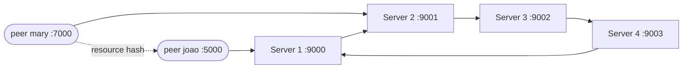

<a id="top"></a>
<h1 align="center">java-p2p</h1>

<p align="center">Uma rede peer-to-peer sobre UDP em que um anel de super-nodes divide o espaço de chaves MD5 — trabalho de faculdade sobre tabelas hash distribuídas, escrito em Java puro.</p>

<p align="center">
  
  
  
</p>

<p align="center"><a href="README.md">🇺🇸 English</a> · <b>🇧🇷 Português</b></p>

---

## Sumário

- [Visão geral](#visao-geral)
- [Arquitetura](#arquitetura)
- [Como funciona](#como-funciona)
- [Protocolo](#protocolo)
- [Estrutura do projeto](#estrutura-do-projeto)
- [Como rodar](#como-rodar)
- [Problemas conhecidos](#problemas-conhecidos)
- [Contexto acadêmico](#contexto-academico)

<a id="visao-geral"></a>
## Visão geral

Este projeto é uma rede peer-to-peer sobre UDP. Os super-nodes (servidores) formam um anel, e cada um é dono de uma fatia do espaço de chaves MD5, o que faz do anel uma tabela hash distribuída (DHT) simples.

Um peer:

1. entra em um super-node com um nickname (`create <nickname>`);
2. se mantém vivo enviando um heartbeat a cada 5 segundos;
3. compartilha um conteúdo, identificado pelo seu hash MD5, e pode registrar esse hash no anel;
4. pode listar todos os recursos registrados no anel;
5. pode perguntar diretamente a outro peer se ele tem o conteúdo de um determinado hash.

Quando um super-node recebe um hash fora da sua fatia, ele encaminha a requisição para o próximo super-node do anel.

Esta versão é mantida como arquivo do código entregue na disciplina.

[↑ voltar ao topo](#top)

<a id="arquitetura"></a>
## Arquitetura



- **Server** (`app/server/Server.java`): um node do anel. Guarda a lista de peers conectados, os contadores de heartbeat e os recursos cujo hash cai na sua fatia.
- **Peer** (`app/peer/Peer.java`): inicia três threads:
  - `PeerThread` recebe pacotes e responde pedidos `resource`;
  - `PeerClient` lê comandos do teclado;
  - `PeerHeartbeat` envia `heartbeat` ao servidor a cada 5 segundos.

[↑ voltar ao topo](#top)

<a id="como-funciona"></a>
## Como funciona

### Espaço de chaves

Cada recurso é identificado pelo hash MD5 do seu conteúdo (32 caracteres hexadecimais, um número entre 0 e 2^128 − 1). Num anel de `N` servidores, o servidor na posição `p` (começando em 1) é dono de:

```
MIN = (2^128 / N) * (p - 1)
MAX = (2^128 / N) * p - 1
```

O cálculo é feito com `BigInteger` em `app/bucket/DHTHashMd5.java`. O `DHTBucket` só guarda um recurso se o hash estiver dentro de `[MIN, MAX]`.

### Peers e heartbeats

- No `create <nickname>`, o servidor guarda o peer (`HostData`: endereço, nickname, porta) e coloca o contador dele em 15.
- Cada `heartbeat <nickname>` volta o contador para 15.
- O servidor recebe pacotes com timeout de 500 ms. Toda vez que um recebimento termina em exceção (inclusive o timeout), o comando `DecreaseHeartBeat` diminui todos os contadores em um. O peer cujo contador chega a 0 é removido e aparece no log como `INACTIVE`.

### Registrando um recurso

1. O peer envia `register <hash>` a um servidor.
2. Se o hash está na fatia desse servidor, ele é guardado junto com a porta do peer (`DATA STORED.`).
3. Senão, o servidor envia `register_ring <hash> <peer_port> <server_port>` ao próximo servidor, que guarda ou encaminha de novo.

### Listando recursos

1. O peer envia `list user` a um servidor.
2. O servidor inicia uma mensagem `list_ring <entradas> <peer_port> <server_port>` com os seus recursos (`hash-porta;hash-porta;…`).
3. Cada servidor do anel acrescenta os seus recursos e passa a mensagem adiante.
4. Quando a mensagem volta ao servidor que a iniciou, ele envia ao peer o cabeçalho `CONTENT_HASH-PEER_PORT` seguido de um pacote por entrada, ou `NO RESOURCE FOUND`.

### Pedindo conteúdo a um peer

O peer envia `resource <hash>` a outro peer, que responde `I HAVE THIS CONTENT!` seguido do conteúdo, ou `I DO NOT HAVE THIS CONTENT...`.

O conteúdo que cada peer compartilha é gerado na inicialização como `<primeiro argumento>_<UUID aleatório>`.

[↑ voltar ao topo](#top)

<a id="protocolo"></a>
## Protocolo

Mensagens de texto, uma por datagrama UDP.

| Mensagem | Origem → destino | Resposta |
| --- | --- | --- |
| `create <nickname>` | peer → servidor | `OK` / `NOT OK` (nickname já em uso) |
| `heartbeat <nickname>` | peer → servidor, a cada 5 s | — |
| `register <hash>` | peer → servidor | guardado localmente ou encaminhado como `register_ring` |
| `register_ring <hash> <peer_port> <server_port>` | servidor → próximo servidor | guardado ou encaminhado de novo |
| `list user` | peer → servidor | inicia um `list_ring` |
| `list_ring <entradas> <peer_port> <server_port>` | servidor → próximo servidor | na volta: `CONTENT_HASH-PEER_PORT` + entradas, ou `NO RESOURCE FOUND` |
| `resource <hash>` | peer → peer | `I HAVE THIS CONTENT!` + conteúdo / `I DO NOT HAVE THIS CONTENT...` |

[↑ voltar ao topo](#top)

<a id="estrutura-do-projeto"></a>
## Estrutura do projeto

```
app/
  server/            Server (loop principal), HostData (peer conectado)
  peer/              Peer (main), PeerThread (recebimento), PeerClient (console), PeerHeartbeat
  command/           ICommand + uma classe por operação:
                     CreateCommand, HeartBeatCommand, DecreaseHeartBeat,
                     RegisterCommand, ListCommand, ListResourseCommand
  bucket/            IDHTBucket/DHTBucket (armazenamento de recursos),
                     IDHTHash/DHTHashMd5 (fatia do espaço de chaves), BucketResource (hash + porta)
  resource_manager/  ResourceManager (conteúdo compartilhado) + hash/Md5HashOperator
  socket/            Socket (wrapper de DatagramSocket) + SocketPayload
Makefile             compila as classes com javac
setup.sh             compila e abre um terminal por servidor e por peer
server_config.json   anel de 4 servidores (portas 9000–9003)
peer_config.json     3 peers (joao, mary, leo)
```

O servidor usa um pequeno padrão Command: cada operação é um `ICommand<T>` com um método `run()`.

[↑ voltar ao topo](#top)

<a id="como-rodar"></a>
## Como rodar

**Requisitos:** um JDK, `make` e — para a inicialização automática — Linux com `gnome-terminal` e `jq`.

**Inicialização automática** (compila e abre um terminal para cada servidor de `server_config.json` e cada peer de `peer_config.json`):

```bash
./setup.sh
```

**Inicialização manual**, a partir da raiz do repositório:

```bash
make

# servidor: <porta> <porta_do_próximo> <posição_no_anel> <tamanho_do_anel>
java app/server/Server 9000 9001 1 2
java app/server/Server 9001 9000 2 2

# peer: <host_do_servidor> "create <nickname>" <porta_do_peer> <porta_do_servidor>
java app/peer/Peer localhost "create joao" 5000 9000
java app/peer/Peer localhost "create mary" 7000 9001
```

**Comandos do console do peer:**

| Comando | Efeito |
| --- | --- |
| `register <server_ip> <server_port>` | registra no anel o hash do conteúdo deste peer |
| `list user <server_ip> <server_port>` | lista todos os recursos do anel |
| `resource <hash> <peer_ip> <peer_port>` | pede a outro peer o conteúdo com esse hash |

As duas últimas palavras de todo comando precisam ser um IP e uma porta.

[↑ voltar ao topo](#top)

<a id="problemas-conhecidos"></a>
## Problemas conhecidos

Uma revisão de código posterior encontrou os seguintes problemas nesta versão:

| # | Onde | Problema |
| --- | --- | --- |
| 1 | `Server.java` | O nickname (`vars[1]`) é lido antes de verificar a quantidade de argumentos, então qualquer pacote de uma palavra só lança exceção. |
| 2 | `Server.java` | Os contadores de heartbeat diminuem dentro de `catch (Exception)`. Eles caem a cada timeout de recebimento **e** a cada pacote malformado: com tráfego constante os peers nunca expiram, e pacotes inválidos os fazem expirar mais rápido. |
| 3 | `DecreaseHeartBeat.java` | `timeout.get()` pode retornar `null` (NPE), e um contador que pula o 0 e fica negativo nunca é removido. |
| 4 | `DHTHashMd5.java` | O `MAX` do último servidor é `(2^128 / N) * N − 1`. Quando `N` não divide 2^128 (ex.: 3 servidores), os maiores hashes não pertencem a nenhum servidor. |
| 5 | `Server.java` (`register_ring`) | Um registro encaminhado nunca verifica se voltou à origem. Um hash sem dono (item 4, ou um valor que não é MD5) fica rodando no anel para sempre. |
| 6 | `Server.java` | O próximo servidor é sempre `localhost`. O `list` é encaminhado para o endereço *do peer* na porta do próximo servidor, e a resposta final vai para o endereço do servidor anterior em vez do peer. O anel só funciona numa única máquina. |
| 7 | `BucketResource.java` | Só a porta do peer é guardada, não o endereço, então a listagem não diz a outras máquinas onde o recurso está. |
| 8 | `Socket.java` | Os pacotes são montados com `content.length()` em vez do tamanho em bytes, usando o charset da plataforma: texto não-ASCII é truncado. O buffer de 1024 bytes trunca em silêncio mensagens `list_ring` longas. |
| 9 | `Socket.java` | Uma falha de bind (porta em uso) só é impressa; o socket fica `null` e falha depois com NPE. `receivePacket` retorna `null` no timeout, e quem chama não verifica. |
| 10 | `PeerClient.java` | Só `IOException` é tratada. Uma linha vazia, um argumento faltando ou uma porta não numérica (`ArrayIndexOutOfBoundsException`, `NumberFormatException`), ou o fim da entrada (`null`), encerram a thread do console. O texto de ajuda lista um comando `peer` que não foi implementado. |
| 11 | `PeerHeartbeat.java` | Imprime `peer_port + 100` como porta, mas faz bind em `peer_port + 200`. Em erro de envio, fecha o socket e continua no loop com o socket fechado. |
| 12 | `HeartBeatCommand.java` | Heartbeats são identificados só pelo nickname, então qualquer host mantém qualquer nickname vivo. Um peer que expirou é ignorado pelos heartbeats seguintes e nunca é registrado de novo. O peer ignora a resposta `NOT OK` do `create`. |
| 13 | `Peer.java` | O conteúdo compartilhado é montado com `args[0]` (o host do servidor, normalmente `localhost`) em vez do nickname. |
| 14 | `Md5HashOperator.java`, `DHTBucket.java` | `HASH IS …` é impresso a cada cálculo de hash; `DHTBucket.get()` imprime o valor em vez de retorná-lo. |
| 15 | Build | O `Makefile` não lista todas as classes e o `make clean` não remove `app/**/*.class`. Arquivos `.class` compilados estão versionados. O `setup.sh` depende de `gnome-terminal` e `jq`, então só roda no Linux. |

[↑ voltar ao topo](#top)

<a id="contexto-academico"></a>
## Contexto acadêmico

Trabalho de faculdade de 2022. Este snapshot é o código exatamente como foi entregue; só esta documentação foi adicionada depois.

[↑ voltar ao topo](#top)
